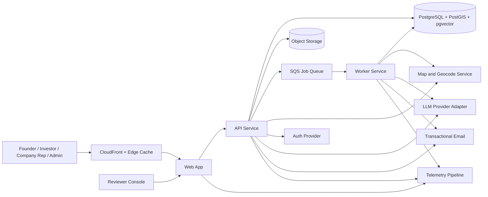
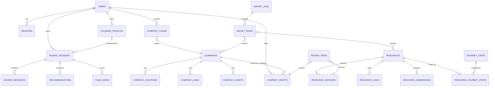

# Production development plan for the Startup State platform

## Executive summary

The strongest interpretation of the brief is not “build a directory with nicer CSS.” It is “replace a library-like state resource experience with a guide that feels personal, fast, and trustworthy.” The current live urlStartup State siteturn0search0 already exposes a filterable resource page, a 19-step entrepreneur journey, and a business-plan generator that saves progress locally and exports a PDF, while the public Builder Day brief asks for two connected products on one official platform: a personalized founder navigator and an investor-ready startup map with self-service company profiles and non-technical updates. citeturn1view0turn5view1turn5view2turn8view0turn8view3turn5view3

The recommended build is a production-oriented modular monolith in a monorepo: a React web front end on urlNext.js App Routerturn13search0, a Node.js TypeScript API service using urlFastifyturn32search0, a background worker, and urlAmazon EKSturn12search12 deployments backed by urlAmazon RDS for PostgreSQLturn12search1 with PostGIS and pgvector. Search and recommendations should use PostgreSQL full-text search plus vector retrieval; mapping should use urlMapLibre GL JSturn23search18 with urlAmazon Location Serviceturn23search0 because AWS explicitly recommends MapLibre for Amazon Location and the service combines maps and geocoding in the same managed stack. AI should be provider-abstracted, with first-class support for urlOpenAI Responses APIturn22search0, structured outputs, moderation, and evals. citeturn13search0turn13search1turn32search0turn12search12turn12search1turn13search19turn15search0turn15search3turn23search1turn23search3turn22search0turn15search2turn22search2turn22search3

MVP scope should center on six outcomes: a guided founder intake and recommendation flow, a manual browse-and-filter resource experience, a persistent founder workbench, a public investor-ready startup map, company claim/create/update workflows with moderation, and an admin console for import, review, dedupe, and publish. The uploaded scope brief also expands the target into an AI Founder Wizard, non-chat manual mode, planner/workbench behavior, analytics, and an optional 16-bit avatar companion; those requirements are incorporated here as first-class design constraints rather than “maybe later” decoration. citeturn1view0turn5view1 fileciteturn0file0

Download the full Markdown blueprint: [startup-state-platform-development-plan.md](sandbox:/mnt/data/startup-state-platform-development-plan.md)

| Decision area | Recommendation | Why this wins |
|---|---|---|
| Delivery shape | Modular monolith in a monorepo | Faster for Codex to generate, easier to test and deploy than microservices, but still cleanly separable into web, api, and worker runtimes. |
| Primary UX | Hybrid wizard + manual exploration | The brief explicitly prioritizes personalization, while the live site already proves users also need direct browsing. |
| Search model | Rules-first hybrid retrieval | Eligibility, stage, geography, and topic rules must remain deterministic; AI should rank and explain, not invent. |
| Map model | Public browse, authenticated edit | Investor friendliness requires zero-friction browsing; trust requires moderated write paths. |
| Admin publishing | In-app review + import pipeline | The brief requires non-technical updates without redeployment. |
| Default cloud | AWS on Kubernetes | Matches the requested default, keeps infra credible for public launch, and leaves room for autoscaling and GitOps. |

The decision table above is synthesis; the enabling platform capabilities come directly from official docs for Next.js, React Server Components, PostgreSQL text search, PostGIS spatial indexing, pgvector, Amazon Location with MapLibre, OpenAI Responses, and EKS. citeturn13search0turn13search1turn15search3turn13search19turn15search0turn23search1turn22search8turn12search12

## Current-state analysis

### Product mandate

The Builder Day brief is unusually explicit about the underlying problem. Utah already has “world-class resources,” but founders face a findability problem, not a pure content-shortage problem. The brief asks teams to help founders find what matters in under two minutes, adapt the experience to the founder’s context, support non-technical updates, and build a second product: a filterable statewide startup map with self-service profiles, lightweight verification, and rich profile fields suitable for investor presentation. It also warns that one fully polished product is better than two rushed ones, which argues for a coherent platform and a disciplined MVP rather than a pile of half-finished features wearing a trench coat. citeturn1view0

### What exists today

The live experience already has useful building blocks, just not a unifying workflow. The journey page organizes entrepreneurship into 19 steps across “thinking of starting,” “start my business,” “grow my business,” and “sell or exit,” and the resource page exposes filters for topic, stage, community, industry, and location. The business-plan generator collects structured inputs and saves progress to the user’s local device rather than a central account-backed workspace. The site also describes itself as iterative, with functionality continuing to evolve, which is a polite way of saying the publishing and product operating model still matters as much as the front end. citeturn8view0turn8view1turn8view2turn8view3turn5view1turn5view2turn5view3

The consequence is straightforward: the platform does not need to invent a new entrepreneurship model from scratch. It needs to operationalize the existing journey, the existing resource corpus, and the new map requirement into a guided, persistent system that can serve three audiences at once: first-time founders, scaling businesses, and outside observers such as investors, partners, and ecosystem operators. citeturn1view0turn8view0turn8view3

### Dataset audit

The provided resource spreadsheet already contains a large amount of useful metadata, but it is shaped for manual curation rather than production retrieval. Its fields include id, title, description, communities, industries, locations, topics, link, and email. Values are frequently pipe-delimited multi-select strings packed into single cells, and the sheet mixes evergreen organizations, stage-specific programs, funding sources, and event listings. Sample rows also show concatenated text with inconsistent spacing and formatting, which is the kind of thing that looks harmless until your filters, imports, and AI prompts start inheriting the chaos. citeturn2view0turn10view0turn10view1turn9view1turn9view2turn9view3

Freshness is a real operational risk, not a theoretical one. In the spreadsheet, the “Silicon Slopes Tech Summit” row still describes the upcoming summit as January 13–17, 2025, while the official Silicon Slopes 2026 materials point to Summit 2026 and separately advertise the agenda for February 4–7. The plan should therefore treat the spreadsheet as a seed dataset, not an unquestioned source of truth, and build freshness scoring, ownership, and review workflows into the admin layer. citeturn10view1turn11search0turn11search7

The map spreadsheet is also directionally useful but incomplete for production. Its top-level fields include display type, LinkedIn link, startup name, full address, description, website, stage, employee count, and section. That is enough to seed profile pages and map points, but it does not include normalized taxonomies, geocodes, duplicate-handling keys, moderation status, profile ownership, edit history, or verification state. Worse, one of the first rows labels the company “Alcomy” while carrying alphaMountain’s cybersecurity description, which is exactly the kind of mismatch that makes any investor-facing map look less curated and more haunted. citeturn3view1turn3view2turn3view3

The reference urlUtah Startup Map on PamPamturn0search1 proves the desired public experience: broad exploration, stage and employee filters, and company pages. It also shows why moderation and dedupe matter. The map page lists both “Nodal Power Inc” and “Nodal Power,” which is survivable in a community map and less survivable in a state-backed product that may be projected in front of investors. citeturn7view0

| Observed issue | Evidence | Product implication |
|---|---|---|
| Discovery is content-rich but workflow-poor | Live site has journey steps, resource filters, and a separate business-plan form instead of a shared workbench | Build a unifying founder workspace, not another isolated page |
| Resource taxonomy is denormalized | Pipe-delimited communities, industries, counties, and topics are embedded in single cells | Normalize lookup tables and joins during import |
| Data freshness is uneven | Event rows can be stale versus official sites | Add review cadence, owners, freshness score, and moderation queues |
| Map data lacks geocodes and verification state | Full address exists, but lat/lng and claim state do not | Add geocoding pipeline and claim/verification workflows |
| Reference map can contain duplicates | “Nodal Power Inc” and “Nodal Power” both appear | Add dedupe scoring and reviewer tooling |
| Current experience is not persistent | Business plan saves locally via cookies | Add account-backed workbench plus anonymous session fallback |

These findings support a very specific implementation stance: deterministic metadata and governance first, AI second. If the platform gets that order backwards, it will produce eloquent nonsense at scale, which is still nonsense. citeturn5view2turn10view1turn3view1turn7view0

## Product strategy and prioritized scope

### Product vision and operating principles

The platform should behave as one product with two public entry points: “Find what I need” for founders and “See what is being built here” for investors and ecosystem participants. Under the hood, both experiences should share the same normalized taxonomy, search index, verification system, import pipeline, analytics model, and admin workflows. This is the only sane way to keep a dual-surface platform maintainable once real content owners, real company edits, and real launch pressure arrive. citeturn1view0 fileciteturn0file0

Five operating principles should govern scope decisions. First, rules beat vibes for eligibility and routing. Second, AI should explain and accelerate but not become the source of truth. Third, every public object should have an accountable owner and review state. Fourth, founder progress must survive browser restarts, account creation delays, and deployment cycles. Fifth, the product should be investor-readable in seconds and founder-useful in minutes. The “find what you need in under two minutes” requirement is the measurement hook for most of the MVP. citeturn1view0

### Prioritized feature list

| Scope band | Feature | Priority | Why it belongs here | MVP exit criterion |
|---|---|---|---|---|
| MVP | Founder intake and persona classifier | P0 | Personalization starts with structured context, not free-form wandering | User can answer intake questions and receive a typed founder profile |
| MVP | AI Founder Wizard with citations | P0 | Directly answers the brief’s navigator requirement while keeping explanations grounded in source data | Recommendations cite underlying resources and store structured plan cards |
| MVP | Manual browse-and-filter resource center | P0 | Some users want control, not chat | Users can filter by stage, topic, community, industry, and county |
| MVP | Founder workbench | P0 | Prevents the business-planning and recommendation flow from becoming one-time theater | Users can save, resume, export, and compare recommendations |
| MVP | Public startup map with filters and profile pages | P0 | Required deliverable and visible investor artifact | Map supports sector, stage, size, hiring, and location filters |
| MVP | Company self-service claim/create/update | P0 | Explicit challenge requirement | Organization representative can claim or draft profile with verification |
| MVP | Admin import, moderation, dedupe, and publish | P0 | Non-technical updates are a hard requirement, not an admin luxury | Admin can import rows, review conflicts, approve, and publish without redeploy |
| MVP | Role-based auth and anonymous session fallback | P0 | Users should not be forced to create accounts before value is obvious | Anonymous flow works; authenticated flow unlocks persistence and edits |
| MVP | Search health and analytics dashboard | P1 | Product quality depends on seeing failed searches, dead resources, and claim bottlenecks | Admin sees top queries, zero-result rates, stale records, and funnel metrics |
| MVP | Business-plan and action-plan export pack | P1 | Extends the existing business-plan behavior into the new workbench | User can export plan summary, resource list, and next-action checklist |
| MVP-lite | Pixel avatar companion | P1 | Present in the uploaded scope; should enhance motivation without becoming the whole app | Can be toggled off, respects reduced motion, and is non-blocking |
| Post-MVP | Read-only GraphQL API | P2 | Useful for external consumers and complex read compositions | Public query layer ships after REST contracts stabilize |
| Post-MVP | Saved alerts and recommendation refreshes | P2 | Converts one-time discovery into ongoing engagement | Users can subscribe to changed resources or new nearby companies |
| Post-MVP | Partner and event integrations | P2 | Reduces spreadsheet churn | Selected partners can submit structured updates |
| Post-MVP | Investor insight views and heat maps | P2 | High-value extension once data quality is trustworthy | Region/sector reports and snapshots are available |
| Post-MVP | Multilingual support | P3 | Important, but only after core data quality and IA are stable | Translation framework and translated taxonomy are in place |

The MVP list tracks directly to the public brief and the uploaded scope expansion: navigation, map, self-service updates, non-technical publishing, quality, analytics, and persistence. The deliberate omission is broad ecosystem integration on day one; the architecture leaves room for it, but the first release should prove usefulness, correctness, and maintainability before it tries to ingest every statewide signal in existence. citeturn1view0 fileciteturn0file0

### Page map and UX structure

| Route or surface | Core audience | Key components | Notes |
|---|---|---|---|
| `/` | Mixed public audience | Value proposition, two entry points, featured stats, latest companies/resources | Keep it legible for investors and founders |
| `/wizard` | Founder | Intake, chat/manual toggle, plan timeline, cited recommendations | Anonymous-first, account-optional |
| `/workbench` | Founder | Saved sessions, tasks, exports, bookmarked resources, readiness checklist | Authenticated persistence |
| `/resources` | Founder, operators | Search, filters, facets, list cards, compare drawer | Manual mode lives here |
| `/resources/:slug` | Founder | Eligibility summary, why suggested, external link, related steps | Use structured metadata and freshness status |
| `/map` | Investor, founder | Cluster map, side panel list, filters, highlight selections | Fast enough for projection and demos |
| `/companies/:slug` | Investor, company rep | Rich profile, hiring, media, links, nearby ecosystem | Public profile page |
| `/claim` | Company rep | Claim existing profile flow | Email/domain + moderation |
| `/submit-company` | Company rep | New company draft form | Supports save-as-draft |
| `/admin` | GOEO staff and reviewers | Imports, moderation queue, dedupe queue, taxonomy manager, analytics | No redeploy for normal content work |
| `/api-docs` | Internal team, future partners | OpenAPI docs and playground | Generated from code/contracts |

This page map intentionally keeps the founder journey and the public map separate at the top level while sharing infrastructure underneath. It avoids the common mistake of forcing every user through a chat flow just because a model is nearby and feeling dramatic. citeturn1view0 fileciteturn0file0

## System architecture, data model, and API blueprint

### Architectural stance

The recommended implementation is a modular monolith with separate deployable runtimes, not a true microservice estate. One monorepo should contain `web`, `api`, and `worker` applications plus shared packages for domain models, schemas, UI, observability, and infrastructure. On Kubernetes, these run as separate deployments. In code, they share types and contracts. This structure gives Codex a realistic chance of generating a coherent codebase while still allowing the team to split search, ingestion, or AI workloads later if traffic or team topology demands it. The challenge requires production quality, but it does not require distributed-systems cosplay. citeturn1view0

### System flow



This flow keeps synchronous requests small and pushes slow work—imports, geocoding, embedding generation, moderation enrichment, exports, email dispatch, and AI draft generation—through a queue-backed worker tier. That architecture aligns with SQS’s role as a decoupling layer, EKS’s role as managed Kubernetes, and OpenAI’s structured-output and eval tooling for reliable agent-like flows. citeturn25search0turn25search4turn12search12turn22search0turn15search2turn22search3

### Recommended stack and alternatives

The stack below is optimized for the brief’s three real constraints: personalization, non-technical operability, and production credibility on an AWS default. The services and frameworks named here are intentionally boring in the good way. Boring is underrated. Boring also tends to ship. citeturn1view0

| Layer | Default choice | Why default | Viable alternative |
|---|---|---|---|
| Web app | urlNext.js App Routerturn13search0 + React | Strong SSR/SEO, server components, mature React ecosystem | Vite + React Router |
| UI system | Tailwind + shadcn/ui | Fast UI assembly with scalable design-system ownership | MUI |
| API | urlFastifyturn32search0 + TypeScript | Schema-first validation and fast route serialization | urlNestJSturn32search1 on Fastify adapter |
| Schema validation | urlZodturn20search3 | Shared runtime validation and type inference | JSON Schema only |
| ORM / migrations | urlPrisma ORMturn20search7 | Type-safe access, migrations, strong DX for Codex | urlDrizzle ORMturn20search1 |
| Primary database | PostgreSQL | Mature relational core, JSON support, FTS | Aurora PostgreSQL if scale pressure justifies it |
| Geospatial | PostGIS | Spatial storage, indexing, and geo queries in the same DB | Separate search engine + DB split |
| Vector search | pgvector | Keeps embeddings close to source records | External vector DB |
| Map rendering | urlMapLibre GL JSturn23search18 | Open client renderer; AWS explicitly recommends it with Amazon Location | Leaflet |
| Maps/geocoding backend | urlAmazon Location Serviceturn23search0 | Managed maps + geocoding on AWS | Mapbox or Google Maps Platform |
| Auth | urlAuth.jsturn14search19 with database sessions | Fast Next.js integration and privacy-friendly control | urlAmazon Cognito user poolsturn14search1 |
| Async jobs | urlAmazon SQSturn25search0 | Decoupled, managed queueing | BullMQ on Valkey/Redis |
| AI provider layer | urlOpenAI Responses APIturn22search0 via adapter interface | Structured outputs, tools, moderation, evals | Anthropic/other provider behind same adapter |
| Containers | Docker | Standard local packaging and CI image build | Podman |
| Orchestration | urlAmazon EKSturn12search12 | Matches requested default and production-grade k8s | ECS/Fargate if team wants lower ops overhead |
| CI | urlGitHub Actionsturn17search0 | Native repo workflows and broad ecosystem | CodeBuild |
| CD | urlArgo CDturn17search2 | GitOps, auditable deployments, environment drift control | Flux |
| E2E testing | urlPlaywrightturn17search3 | Chromium/Firefox/WebKit coverage | Cypress |
| Observability | urlOpenTelemetryturn19search0 + Prometheus/Grafana + CloudWatch | Vendor-neutral traces/metrics with AWS-native alarms | Datadog-only stack |
| IaC | urlTerraform AWS providerturn17search1 | Clear module boundaries and broad talent pool | urlAWS CloudFormationturn28search0 / CDK |

The reasons for the main choices are grounded in official docs: Next.js App Router is built around Server Components and server-side rendering patterns; PostgreSQL supports full-text search, while PostGIS adds spatial data and GiST-based spatial indexes; pgvector adds exact and approximate similarity search inside Postgres; Amazon Location recommends MapLibre and provides maps plus geocoding; Auth.js supports JWT and database session patterns; Cognito acts as an OIDC provider; OpenAI recommends Responses for new projects and supports tools, structured outputs, moderation, and evals; GitHub Actions automates workflows; Argo CD uses Git as source of truth; and Playwright supports Chromium, Firefox, and WebKit. For UI and data-access ergonomics, Tailwind is utility-first, shadcn/ui presents itself as an open code foundation for a design system, Prisma provides type-safe database access, and Drizzle remains a lighter-weight alternative. citeturn13search0turn13search1turn15search3turn13search19turn15search0turn23search1turn23search3turn14search3turn14search1turn22search8turn22search1turn15search2turn22search2turn22search3turn17search0turn17search2turn17search3turn30search8turn30search5turn20search7turn20search1

### Data model

The database must preserve editorial trust, recommendation explainability, and public browse speed. That means normalized lookup tables, explicit audit states, separate revision objects for unreviewed edits, and search/index support embedded close to the canonical records. The design below keeps public and editorial concerns in one schema without mixing draft content directly into published records. citeturn10view0turn3view1

| Domain | Core tables | Key fields |
|---|---|---|
| Identity | `users`, `sessions`, `roles`, `user_role_bindings` | `email`, `auth_provider`, `session_expires_at` |
| Founder guidance | `founder_profiles`, `wizard_sessions`, `wizard_messages`, `recommendations`, `plan_cards`, `saved_resources` | founder stage, industry, county, goals, constraints, citations |
| Resources | `resources`, `resource_versions`, `resource_links`, `journey_steps`, `resource_journey_steps` | title, summary, canonical_url, status, freshness score |
| Taxonomy | `topics`, `industries`, `communities`, `counties`, `stages`, join tables | normalized filter dimensions |
| Search and AI | `resource_documents`, `resource_embeddings`, `search_queries`, `ai_runs`, `ai_eval_cases` | `tsvector`, embedding vector, latency, model, groundedness status |
| Companies and map | `companies`, `company_locations`, `company_links`, `company_assets`, `company_tags` | slug, description, headcount band, stage, hiring flag, geo point |
| Claims and moderation | `company_claims`, `company_drafts`, `review_items`, `review_decisions`, `audit_logs` | claim status, verification method, reviewer, decision reason |
| Imports | `import_jobs`, `import_rows`, `dedupe_candidates`, `sync_sources` | source hash, row payload, conflict status, importer version |



### Key schema notes

Resource records should separate the canonical published object from editorial revisions. Company edits should never mutate the public profile directly. Instead, authenticated claimants create or modify `company_drafts`; reviewers approve a diff that becomes the next published version. This protects public trust and gives GOEO a clean moderation trail. PostgreSQL Row-Level Security should be used as defense in depth on founder workbench objects and claimant-owned drafts, not as the sole access-control mechanism. citeturn26search3turn26search13

For geospatial queries, store company coordinates as a PostGIS geography point and maintain a denormalized map search document with stage, sector, employee band, hiring status, and county. For resource search, maintain both `tsvector` columns for weighted keyword search and an embedding store for semantic retrieval. This enables hybrid search without fragmenting data across too many systems too early. citeturn13search3turn13search11turn15search3turn15search15turn15search0

### API design principles

The platform should ship REST-first, with OpenAPI as the executable contract, and reserve GraphQL for read-heavy aggregation after the domain stabilizes. That is not ideology. It is change management. The OpenAPI specification exists specifically to make HTTP APIs discoverable for both people and tools; GraphQL remains valuable when clients need flexible field selection across multiple related object types. MVP should therefore prefer stable REST resources for writes, moderation, imports, and exports, while keeping a post-MVP read-only GraphQL facade for map and dashboard consumers. citeturn21search4turn21search19turn21search6

#### Authentication model

Use three access modes.  
`anonymous` supports founder intake, wizard experimentation, and temporary workbench state via a signed cookie-backed anonymous session.  
`authenticated-user` unlocks persistent workbench storage, exports, bookmarks, and notifications.  
`company-editor` adds claim and draft-edit privileges. `reviewer` and `admin` add moderation, taxonomy, and import controls. Database sessions are the preferred default for web users because Auth.js explicitly supports database and JWT session strategies, while Cognito remains the right alternative when enterprise federation or broader OIDC/SAML requirements become primary. citeturn14search3turn14search1turn14search2turn14search7

#### Endpoint catalog

| Method | Path | Audience | Purpose |
|---|---|---|---|
| POST | `/v1/anonymous-sessions` | Public | Create signed anonymous wizard/workbench session |
| POST | `/v1/auth/email/start` | Public | Start magic-link auth |
| POST | `/v1/auth/logout` | Authenticated | End session |
| GET | `/v1/me` | Authenticated | Current user and roles |
| POST | `/v1/founder-profiles` | Public/Auth | Upsert intake profile |
| POST | `/v1/wizard/sessions` | Public/Auth | Create wizard session |
| GET | `/v1/wizard/sessions/:id` | Owner/Admin | Retrieve session state |
| POST | `/v1/wizard/sessions/:id/messages` | Owner/Admin | Submit prompt/manual action and get structured recommendation step |
| POST | `/v1/wizard/sessions/:id/export` | Owner/Admin | Create export pack job |
| GET | `/v1/resources` | Public | Search and filter resources |
| GET | `/v1/resources/facets` | Public | Filter metadata |
| GET | `/v1/resources/:slug` | Public | Resource detail |
| POST | `/v1/resources/search` | Public | Advanced hybrid search |
| GET | `/v1/companies` | Public | List or map-query companies |
| GET | `/v1/companies/geo` | Public | Viewport-bounded GeoJSON/JSON response |
| GET | `/v1/companies/:slug` | Public | Company profile |
| POST | `/v1/company-claims` | Authenticated | Claim existing company |
| POST | `/v1/company-drafts` | Authenticated | Create new company submission draft |
| PATCH | `/v1/company-drafts/:id` | Owner/Reviewer | Edit draft |
| POST | `/v1/company-drafts/:id/submit` | Owner | Submit for review |
| POST | `/v1/company-drafts/:id/verify-domain` | Owner | Begin domain/email verification |
| GET | `/v1/admin/reviews` | Reviewer/Admin | Moderation queue |
| POST | `/v1/admin/reviews/:id/approve` | Reviewer/Admin | Approve draft or revision |
| POST | `/v1/admin/reviews/:id/reject` | Reviewer/Admin | Reject with reason |
| POST | `/v1/admin/imports/resources` | Admin | Upload/import resource dataset |
| POST | `/v1/admin/imports/companies` | Admin | Upload/import company dataset |
| GET | `/v1/admin/imports/:id` | Admin | Import status and row conflicts |
| GET | `/v1/admin/analytics/search` | Admin | Search metrics and zero-result reports |

#### Representative request and response schemas

```json
POST /v1/wizard/sessions

{
  "anonymousSessionId": "anon_01J...",
  "entryPoint": "homepage-founder",
  "mode": "guided",
  "locale": "en-US"
}
```

```json
201 Created

{
  "id": "wiz_01J...",
  "status": "in_progress",
  "mode": "guided",
  "requiredProfileFields": [
    "founder_stage",
    "industry",
    "county",
    "goal"
  ],
  "workbenchUrl": "/workbench/wiz_01J..."
}
```

```json
POST /v1/wizard/sessions/:id/messages

{
  "message": "I have a food truck idea in St. George and need permits, funding, and startup basics.",
  "profilePatch": {
    "founderStage": "idea",
    "industrySlug": "hospitality-food-services",
    "countySlug": "washington",
    "communitySlugs": ["rural"]
  }
}
```

```json
200 OK

{
  "assistant": {
    "messageId": "msg_01J...",
    "mode": "guided",
    "summary": "Start with licensing, local advising, and small non-dilutive funding options.",
    "nextQuestions": [
      "Will you operate from a fixed commissary kitchen?",
      "Do you already have an LLC?"
    ]
  },
  "recommendations": [
    {
      "resourceSlug": "utah-tech-business-resource-center",
      "why": "Matches early-stage business setup and southern Utah support.",
      "confidence": 0.89,
      "citations": ["resource:2556"]
    }
  ],
  "planCards": [
    {
      "title": "Register business and confirm local permits",
      "dueWindow": "7_days",
      "status": "suggested"
    }
  ],
  "guardrails": {
    "usedDeterministicFilters": true,
    "externalBrowsingUsed": false
  }
}
```

```json
GET /v1/resources?stage=start-a-business&county=washington&topic=funding&q=food

{
  "items": [
    {
      "slug": "teen-entrepreneur-support-center",
      "title": "Teen Entrepreneur Support Center",
      "summary": "Free resources, mentorship, and events for young entrepreneurs.",
      "stageSlugs": ["start-a-business"],
      "topicSlugs": ["entrepreneurship-communities", "funding", "marketing-and-sales"],
      "countySlugs": ["washington"],
      "freshness": {
        "status": "reviewed",
        "reviewedAt": "2026-04-22T18:25:12Z"
      }
    }
  ],
  "facets": {
    "topics": [{"slug": "funding", "count": 14}],
    "counties": [{"slug": "washington", "count": 26}]
  },
  "page": {
    "cursor": null,
    "hasNextPage": false,
    "totalApprox": 1
  }
}
```

```json
POST /v1/company-drafts/:id/submit

{
  "verificationMethod": "work_email",
  "workEmail": "founder@examplestartup.com",
  "attestation": true
}
```

```json
202 Accepted

{
  "draftId": "cmpdraft_01J...",
  "submissionStatus": "pending_verification",
  "reviewStatus": "queued",
  "checks": [
    {
      "type": "domain_match",
      "status": "sent"
    }
  ]
}
```

The request contracts should be generated into shared TypeScript types and test fixtures. Validation should run at the API boundary and again at import boundaries. Fastify’s schema-first validation and serialization model fits this well, while OpenAPI remains the external contract artifact for docs, clients, and contract testing. citeturn32search0turn21search4turn21search19

#### Error model

| HTTP | Code | Meaning | Caller action |
|---|---|---|---|
| 400 | `VALIDATION_ERROR` | Request body/query/path invalid | Fix client payload |
| 401 | `AUTH_REQUIRED` | Authentication missing/expired | Re-authenticate |
| 403 | `FORBIDDEN` | Role or ownership mismatch | Hide action or escalate |
| 404 | `NOT_FOUND` | Resource missing | Show empty state |
| 409 | `CONFLICT` | Duplicate claim or concurrent edit | Resolve with latest server state |
| 422 | `VERIFICATION_REQUIRED` | Draft cannot publish until verification completes | Complete email/domain proof |
| 429 | `RATE_LIMITED` | Abuse or quota protection triggered | Retry with backoff |
| 503 | `DEPENDENCY_UNAVAILABLE` | Search, AI, geocode, or email dependency degraded | Fallback gracefully |
| 504 | `AI_TIMEOUT` | Model response exceeded budget | Retry or switch to manual mode |

```json
{
  "error": {
    "code": "VALIDATION_ERROR",
    "message": "industrySlug is required",
    "details": [
      {
        "field": "industrySlug",
        "reason": "required"
      }
    ],
    "requestId": "req_01J..."
  }
}
```

#### GraphQL read layer

REST should remain the write system of record. Post-MVP, add a read-only `/graphql` endpoint for the web app and future ecosystem consumers that need flexible list/detail aggregation with minimal overfetch. Keep mutations off GraphQL until moderation and auditing patterns are fully settled. This keeps the contract surface sane and aligns with GraphQL’s strengths as a query language rather than trying to use it as a substitute for every operational workflow. citeturn21search6turn21search12

```graphql
type Query {
  resources(filter: ResourceFilter, first: Int = 20, after: String): ResourceConnection!
  companies(filter: CompanyFilter, first: Int = 50, after: String): CompanyConnection!
  company(slug: String!): Company
  wizardSession(id: ID!): WizardSession
}
```

### AI and recommendation architecture

The AI layer should be narrow, inspectable, and replaceable. Use deterministic filters first: stage, geography, industry, community, funding type, audience, and publish status. Then perform hybrid retrieval over the filtered candidate set using PostgreSQL full-text search and embeddings stored in pgvector. Finally, pass the candidate set—never the full corpus—to the model for ranking, explanation, follow-up questions, and structured plan-card generation. This architecture uses the model where language matters and keeps policy, eligibility, and trust anchored in system-owned data. citeturn15search3turn15search15turn15search0turn22search0turn15search2

For the default provider, use urlOpenAI Responses APIturn22search0 with structured outputs, tool calling, moderation, and evals. Responses is the recommended API path for new projects; structured outputs enforce schema fidelity; moderation is available for text and images; and evals should be used continuously to assess groundedness, relevance, and plan usefulness. Wrap the provider behind an internal adapter so that the rest of the application depends on `recommend(profile, context)` and `draftPlanCards(...)`, not on vendor-specific request shapes. citeturn22search8turn15search2turn22search2turn22search3turn22search10

AI safety controls should be concrete. Treat imported descriptions, external links, and claimed company content as untrusted input; strip HTML; never allow the model to call arbitrary external tools; require allowlisted tool definitions only; redact secrets from prompts; and keep all public-facing recommendations tied to source citations and deterministic eligibility metadata. Prompt injection is the top-listed risk in OWASP’s LLM guidance, so the safe default is a constrained tool surface and a short prompt supply chain, not a “model can browse anything because demos are more fun” architecture. citeturn27search1turn27search4turn18search8

### Avatar companion

If the uploaded scope’s 16-bit avatar is included in MVP, implement it as a presentational motivational layer, not a central dependency. Store avatar state as a small UI preference plus progression-derived mood/state, render it from sprite sheets in the web client, keep motion optional, and provide a one-click mute/off switch. The avatar should react to milestones like “profile complete,” “three resources saved,” or “export created,” not narrate every UI action like an overcaffeinated tour guide. Accessibility requirements under WCAG 2.2 mean respecting reduced motion, keyboard operation, readable text alternatives, and no essential information communicated only through animation. citeturn18search2turn18search14 fileciteturn0file0

## Delivery, operations, and governance

### Deployment topology

Production should use three Kubernetes deployments—`web`, `api`, and `worker`—behind an Application Load Balancer managed by the AWS Load Balancer Controller. Images should be stored in Amazon ECR. Secrets should be stored and rotated through AWS Secrets Manager. The primary application data tier should be RDS PostgreSQL with Multi-AZ enabled for production; object uploads and export artifacts should land in S3; queue-backed asynchronous work should use SQS; and public assets should be cached through CloudFront. This matches the requested default stack while preserving a straightforward path to autoscaling, GitOps, and disaster recovery. citeturn24search4turn24search1turn29search5turn24search2turn24search13turn26search2turn26search15turn25search0turn12search3turn33search3

A practical environment model is `local`, `dev`, `stage`, and `prod`. Local runs with Docker Compose and mocked external providers. `dev` autodeploys from main. `stage` mirrors production integrations and uses production-like seeded data. `prod` uses blue/green or progressive rollout with approval gates. The reason for keeping local development off full cloud reliance is simple: Codex and humans both move faster when basic workflows do not require provisioning half the internet before breakfast. This is a planning recommendation anchored in the AWS control-plane and service model, not a contradiction of the default cloud target. citeturn12search12turn29search7turn30search2turn30search3

### Infrastructure-as-code examples

The plan should standardize on Terraform as the primary IaC authoring tool because it provides clear module boundaries and strong AWS support, while still shipping a minimal CloudFormation alternative for teams that prefer AWS-native IaC. AWS’s own guidance frames CloudFormation and CDK as first-class IaC options on AWS, while Terraform modules remain a widely supported operational pattern. citeturn17search1turn17search9turn28search0turn28search5turn28search1

```hcl
terraform {
  required_version = ">= 1.8.0"
  required_providers {
    aws = {
      source  = "hashicorp/aws"
      version = "~> 6.43"
    }
  }
}

provider "aws" {
  region = var.region
}

module "network" {
  source  = "./modules/network"
  name    = var.app_name
  cidr    = "10.40.0.0/16"
  az_count = 3
}

module "eks" {
  source       = "./modules/eks"
  cluster_name = "${var.app_name}-${var.env}"
  vpc_id       = module.network.vpc_id
  subnet_ids   = module.network.private_subnet_ids
}

resource "aws_db_instance" "postgres" {
  identifier              = "${var.app_name}-${var.env}"
  engine                  = "postgres"
  engine_version          = "16"
  instance_class          = "db.r6g.large"
  allocated_storage       = 100
  storage_encrypted       = true
  multi_az                = var.env == "prod"
  db_subnet_group_name    = module.network.db_subnet_group
  vpc_security_group_ids  = [module.network.db_sg_id]
  backup_retention_period = var.env == "prod" ? 14 : 3
  deletion_protection     = var.env == "prod"
}

resource "aws_s3_bucket" "assets" {
  bucket = "${var.app_name}-${var.env}-assets"
}

resource "aws_sqs_queue" "jobs" {
  name                      = "${var.app_name}-${var.env}-jobs"
  visibility_timeout_seconds = 120
}
```

```yaml
AWSTemplateFormatVersion: "2010-09-09"
Description: Minimal Startup State platform primitives

Resources:
  AssetsBucket:
    Type: AWS::S3::Bucket
    Properties:
      BucketEncryption:
        ServerSideEncryptionConfiguration:
          - ServerSideEncryptionByDefault:
              SSEAlgorithm: AES256

  JobsQueue:
    Type: AWS::SQS::Queue
    Properties:
      VisibilityTimeout: 120
      MessageRetentionPeriod: 345600

  AppSecret:
    Type: AWS::SecretsManager::Secret
    Properties:
      Name: startup-state/app/base
      Description: Base application secrets

Outputs:
  AssetsBucketName:
    Value: !Ref AssetsBucket
  JobsQueueUrl:
    Value: !Ref JobsQueue
  AppSecretArn:
    Value: !Ref AppSecret
```

### CI/CD strategy

CI should run on every pull request and include repository-level quality gates: formatting, type-checking, linting, unit tests, API schema validation, migration diff checks, dependency vulnerability scan, and preview build. CD should be GitOps-based: main branch merges produce immutable images in ECR, environment manifests update in a deploy repository, and Argo CD syncs the cluster state from Git. This creates an auditable deployment trail and keeps operational changes versioned alongside application changes. citeturn17search0turn17search2turn29search2

A practical pipeline has four lanes. `verify` handles local-fast checks. `build` creates signed container images. `promote` deploys to dev and stage automatically. `release` requires manual approval for production, then runs smoke tests, synthetic checks, and rollback automation. For database changes, require expand/migrate/contract discipline: add nullable columns first, backfill, deploy readers, then tighten constraints in a later release. There is nothing glamorous about migration safety, but there is also nothing glamorous about explaining downtime to a public-sector stakeholder. citeturn17search0turn29search11

### Testing strategy and QA plan

Testing should follow a deliberate pyramid, not a mystical feeling that “we have some tests somewhere.” Use unit tests for domain rules, import parsing, ranking heuristics, and schema helpers; integration tests for auth, persistence, queue consumers, search queries, and moderation flows; and end-to-end tests for the founder journey, company-claim lifecycle, admin import/review, and public map browsing. citeturn20search2turn17search3

| Test layer | Tooling | What must be covered |
|---|---|---|
| Unit | Vitest | Domain services, filter builders, ranking logic, prompt assembly, serializers |
| Contract | OpenAPI diff + generated clients | Route schemas, status codes, backward compatibility |
| Integration | Test DB + worker harness | Auth flows, imports, queue jobs, geocoding adapters, DB queries |
| Component | React Testing Library + axe | Accessibility and UI states |
| E2E | Playwright | Founder wizard, workbench resume, map filters, company claim, admin moderation |
| AI evals | Golden datasets + provider eval APIs | Relevance, groundedness, factual consistency, refusal behavior |

The QA plan should include five additional controls. First, golden import fixtures based on the provided resource and map data. Second, regression suites for stale-data and mismatch scenarios discovered in the seed spreadsheets. Third, accessibility sweeps against WCAG 2.2 AA. Fourth, moderated-content test cases for malicious company submissions and prompt-injection attempts. Fifth, launch-readiness UAT sessions with at least one founder persona from southern Utah, one student founder persona, one growth-stage company persona, and one investor/external viewer persona. citeturn10view1turn3view1turn18search2turn27search1turn22search10

### Security, compliance, and privacy

The baseline security program should map to OWASP ASVS for web application controls, OWASP API Security Top 10 for API-specific risks, NIST Privacy Framework for privacy risk management, and WCAG 2.2 AA for accessibility. This is the right level of rigor for a public-facing, state-adjacent platform that will handle user identities, business contact data, and moderated submissions, but is not initially positioned as a regulated filing system or benefits administration system. citeturn18search3turn18search8turn18search1turn18search2turn18search14

Encrypt all data in transit with TLS and all persisted secrets with AWS KMS-backed services. Store application secrets in Secrets Manager, not in Kubernetes manifests or CI variables. Use least-privilege IAM roles for pods, rotate secrets, and enable audit logging for all admin approvals, taxonomy changes, imports, and profile publication events. On the data side, keep PII collection intentionally small: email, role, verification artifacts, and activity needed to preserve workbench state. Do not collect sensitive business documents unless and until a concrete workflow requires it. citeturn24search2turn24search13turn26search14turn26search11

Row-Level Security in PostgreSQL should protect founder workbench records and company drafts as defense in depth, while the application layer remains the primary authorization point. Apply rate limits to auth and write-heavy endpoints, use email/domain verification for company claims, and quarantine newly submitted or edited public content until reviewer approval. The most likely abuse cases are spam profiles, impersonation, low-effort SEO junk, and LLM prompt-injection strings hidden in descriptions or links. Design for those cases explicitly. citeturn26search3turn18search4turn27search1turn27search4

### Scalability, performance, and monitoring

The platform should optimize for fast reads, controllable writes, and bounded AI latency. Target p95 response times of under 500 ms for resource search, under 800 ms for viewport-bounded map responses, and under 6 seconds median for AI-backed wizard turns, with a graceful fallback to deterministic recommendations if the provider is slow or unavailable. Use materialized search documents, precomputed facets, geospatial indexes, SQS-backed background work, and CloudFront for cacheable public assets. Add read replicas and Redis/Valkey caching only after metrics show sustained pressure; do not prebuild an expensive shrine to hypothetical traffic. citeturn15search3turn13search19turn19search0turn19search1turn19search3turn25search0turn33search3

Instrumentation should be standardized on OpenTelemetry for spans, metrics, and logs, exported into Prometheus/Grafana and AWS-native alarms. CloudWatch alarms should cover API error rate, queue age, worker failure rate, RDS storage/headroom, elevated AI timeout rate, and import freshness breaches. The platform should expose domain dashboards for zero-result searches, recommendation CTR, wizard completion, company claim conversion, reviewer SLA, and stale record counts. Operational observability without product observability is just a prettier outage when the wrong founders keep seeing the wrong things. citeturn19search0turn19search1turn19search6turn19search19turn19search11

| SLO / KPI | Target | Owner |
|---|---|---|
| Resource search p95 | `< 500 ms` | API/backend |
| Map viewport query p95 | `< 800 ms` | Backend/data |
| Wizard turn median | `< 6 s` with AI, `< 500 ms` fallback | AI/backend |
| Import freshness | `< 24 h` for seeded sources | Data/admin |
| Reviewer turnaround | `< 2 business days` | Operations/admin |
| Zero-result search rate | `< 8%` after six weeks | Product/search |
| Recommendation click-through | `> 25%` for top 3 cards | Product |

### Cost and effort estimates

Cloud cost should be estimated in bands, not fake precision. Official AWS pricing confirms that EKS adds an hourly cluster charge, RDS is pay-as-you-go, ElastiCache is consumption based, and S3 is storage and transfer based. The largest variable cost outside core infrastructure will likely be AI token usage and geocoding/map traffic. That means the cheapest useful control is product instrumentation: know which calls are valuable before you optimize the bill after the fact. citeturn12search0turn12search1turn12search2turn12search3turn12search5turn23search12

| Environment shape | Monthly planning band | Main cost drivers |
|---|---|---|
| Local dev + mocks | Near-zero to low | AI dev usage, email sandbox, occasional cloud fixtures |
| Shared demo/dev environment | Moderate | One EKS cluster, one Postgres instance, S3, logs, low map/geocode usage |
| Stage mirror | Moderate to high | Additional cluster/DB, realistic seed data, preview artifacts, test runs |
| Production pilot | High | HA database, EKS, CloudFront, observability, queue processing, map geocoding, AI usage |

| Workstream | Person-weeks | Confidence |
|---|---|---|
| Product discovery, IA, and design system | 5–7 | High |
| Web foundation, auth, and workbench shell | 6–8 | High |
| Resource search, facets, and detail experience | 8–10 | High |
| Founder wizard and recommendation engine | 12–16 | Medium |
| Map, company profiles, claims, and geocoding | 12–15 | Medium |
| Admin CMS, import pipeline, and moderation | 10–12 | Medium |
| Observability, security hardening, accessibility, and release | 8–10 | Medium |
| Total MVP | 61–78 | Medium |

The effort estimate assumes a 16-week MVP run with a six-to-seven-person cross-functional team. It also assumes the team treats the supplied sheets as seed data and not as “done data,” which is a distinction worth a surprising amount of money. citeturn10view1turn3view1

## Roadmap, sprint backlog, risks, and Codex handoff

### Team roles and milestone structure

A practical delivery team is: one product lead, one designer, one tech lead, one frontend engineer, one backend engineer, one AI/search engineer, one part-time DevOps/SRE, and one part-time QA automation engineer, with data/import responsibilities split between backend and AI/search. This is enough to move quickly without turning every decision into a committee meeting disguised as collaboration. The roadmap below is built for eight two-week sprints plus a short inception/setup window. citeturn1view0 fileciteturn0file0

| Milestone | Outcome |
|---|---|
| Inception | Contracts, architecture, design system, seeded taxonomy, repo foundations |
| Navigation beta | Resource search and founder intake are usable end to end |
| Map beta | Public map and company profile pages are usable end to end |
| Editorial beta | Claim, moderation, import, and publish workflows operate without redeploy |
| AI beta | Grounded recommendations, exports, and eval harness are live |
| Launch candidate | Security, accessibility, observability, rollback, and stakeholder UAT complete |

### Sprint backlog

| Sprint | Goal | Key sprint tasks | Exit criteria |
|---|---|---|---|
| Sprint 0 | Foundation | Monorepo setup, CI skeleton, Docker, local compose, design tokens, auth baseline, schema decisions, import contract definitions | Repo boots locally; CI passes; initial ADRs approved |
| Sprint 1 | Resource core | Normalize taxonomy, seed resource imports, resource search API, facets, list page, detail page, analytics events | User can browse and filter resources with seeded data |
| Sprint 2 | Founder intake and workbench | Founder profile model, anonymous sessions, workbench shell, bookmarks, saved states, export job skeleton | Founder can start, pause, and resume guided exploration |
| Sprint 3 | Wizard v1 | Deterministic routing rules, hybrid candidate retrieval, AI ranking/explanation, cited recommendation cards, fallback mode | Founder receives grounded recommendations with citations |
| Sprint 4 | Map v1 | Company import, geocoding job, map API, cluster/list UI, company profile page, filter model | Public map performs well with seeded companies |
| Sprint 5 | Claims and moderation | Claim flow, company draft editing, verification email/domain flow, admin moderation queue, audit logs | Company rep can claim/edit; reviewer can approve/reject |
| Sprint 6 | Admin publishing and quality | Import UI, dedupe workflow, stale-data dashboard, taxonomy management, analytics dashboards | Non-technical operator can update content without redeploy |
| Sprint 7 | Hardening and launch prep | Accessibility remediation, security fixes, load tests, AI eval expansion, release runbooks, smoke tests, rollback drill | Launch checklist passes in stage |
| Sprint 8 | Launch candidate | Stakeholder UAT, production cutover, monitoring tuning, docs finalization, training for content owners | Production-ready release approved |

### Risk register

| Risk | Likelihood | Impact | Mitigation |
|---|---|---|---|
| Seed data is stale or inconsistent | High | High | Add freshness scoring, owner fields, review SLAs, and import conflict dashboards |
| Scope creep across wizard, map, admin, avatar, and analytics | High | High | Tie MVP to six outcomes and put integrations/GraphQL in post-MVP |
| AI hallucinates eligibility or suggests irrelevant resources | Medium | High | Deterministic prefiltering, structured outputs, citation requirement, eval harness |
| Company claims are abused by non-owners | Medium | High | Work-email/domain verification, moderation queue, audit logs |
| Dirty addresses break map credibility | Medium | Medium | Geocode worker with confidence threshold, manual correction interface |
| Accessibility debt accumulates late | Medium | High | Component-level accessibility checks from sprint 0 and weekly audits |
| Kubernetes adds too much operational drag | Medium | Medium | Keep runtime count low, GitOps simple, avoid service sprawl, document local compose |
| AI and map costs spike unpredictably | Medium | Medium | Budget tags, usage dashboards, per-feature quotas, cache where justified |
| Stakeholder reviews delay publishing rules | Medium | Medium | Agree content governance and acceptance criteria in sprint 0 |
| Integration lock-in becomes uncomfortable | Low | Medium | Use adapters for AI, maps, auth, and email providers |

### Handoff artifacts for Codex

Codex should not receive a generic “build the app” request. It should receive a deterministic asset pack. The handoff bundle should include at minimum:

| Artifact | Purpose |
|---|---|
| `docs/build-plan.md` | This full plan, including acceptance criteria |
| `docs/openapi/openapi.yaml` | Contract-first REST spec |
| `docs/graphql/schema.graphql` | Post-MVP read schema target |
| `docs/adr/*.md` | Architecture decision records |
| `packages/db/prisma/schema.prisma` | Canonical relational model |
| `packages/contracts/*` | Shared Zod schemas and generated TS types |
| `packages/fixtures/*` | Seed rows, import fixtures, and persona test vectors |
| `apps/web`, `apps/api`, `apps/worker` | Executable targets |
| `infra/terraform/*` and `infra/cloudformation/*` | Environment provisioning |
| `infra/k8s/*` | Helm or Kustomize manifests |
| `tests/e2e/*` | Playwright persona suites |
| `tests/evals/*` | AI grounding and recommendation eval cases |
| `runbooks/*` | Import, moderation, and rollout procedures |

#### Suggested repository structure

```text
startup-state-platform/
  apps/
    web/
    api/
    worker/
  packages/
    ui/
    config/
    contracts/
    db/
    auth/
    ai/
    search/
    taxonomy/
    observability/
  infra/
    terraform/
    cloudformation/
    k8s/
  docs/
    build-plan.md
    openapi/
    graphql/
    adr/
    runbooks/
  tests/
    unit/
    integration/
    e2e/
    evals/
  scripts/
    seed/
    import/
    ops/
```

#### Code generation targets

| Target | Generation rule |
|---|---|
| API server types | Generate from Zod/OpenAPI source of truth |
| Client SDK | Generate TypeScript client from OpenAPI |
| Database client | Generate Prisma client from Prisma schema |
| GraphQL typed queries | Generate after GraphQL read schema exists |
| Fixtures | Generate seed and eval fixtures from canonical JSON/YAML |
| Test users and roles | Generate from role matrix for e2e and integration suites |

#### Test vectors

| Persona | Input | Expected outcome |
|---|---|---|
| Idea-stage food entrepreneur in St. George | No entity formed, needs permits and starter funding | Sees local advising, licensing, and beginner funding resources first |
| Student SaaS founder in Utah County | Wants mentorship, validation, and pitch opportunities | Sees university, student, and startup-community resources first |
| Rural manufacturer seeking export help | Existing small business, wants growth and trade support | Sees export, operations, workforce, and funding resources first |
| Growth-stage software company hiring in Lehi | Wants talent and community visibility | Appears in map filters, can claim profile, sees growth-stage resource path |
| Investor exploring Utah climate tech | Browses map by sector/stage/location | Gets fast map/filter experience and strong company summaries |

#### Definition of done before handoff is complete

The Codex handoff is not complete until the repo can do all of the following in a fresh environment: boot locally with mocks, seed data, run unit/integration/e2e suites, generate API docs, apply database migrations, run import jobs, and deploy a preview environment from CI. Anything less becomes a scavenger hunt, and scavenger hunts are charming only when nobody is depending on your launch.

#### Open questions and limitations

A few decisions still need explicit product-owner signoff before implementation starts. The biggest ones are whether the 16-bit avatar is mandatory for MVP or acceptable as an MVP-lite feature, which datasets are authoritative enough to auto-publish versus always requiring review, what exact verification policy GOEO wants for company claims, and whether an external partner API is truly needed in the first release or merely sounds ambitious in a slide deck. None of these questions block foundation work, but they do affect moderation rules, UI complexity, and release scope.

#### Codex execution prompt

```text
Build the Startup State platform as a production-oriented monorepo with:
- apps/web: Next.js App Router frontend
- apps/api: Node.js TypeScript API (Fastify preferred)
- apps/worker: async jobs and imports
- PostgreSQL + PostGIS + pgvector
- OpenAPI-first REST API under /v1
- optional read-only GraphQL scaffold, disabled by default
- Auth.js-based auth with anonymous session fallback
- company claim/create/update with moderation workflow
- founder wizard + manual resource browse + persistent workbench
- public startup map + company profile pages
- admin import/review/dedupe/publish console
- Docker, local compose, Kubernetes manifests, Terraform samples
- GitHub Actions CI, Argo CD manifests, Playwright e2e tests
- OpenTelemetry instrumentation, health checks, structured logging
- accessibility-first UI with reduced-motion support
- no placeholders, no pseudo-code, no “existing code here” gaps

Use the build plan as the source of truth.
Generate complete files only.
If external credentials are absent, provide local mocks for AI, maps, email, and object storage.
Use deterministic retrieval and citations for recommendations.
Do not let the LLM become the source of truth for eligibility.
Ship seed scripts and fixtures that reproduce the supplied resource and company datasets.
```